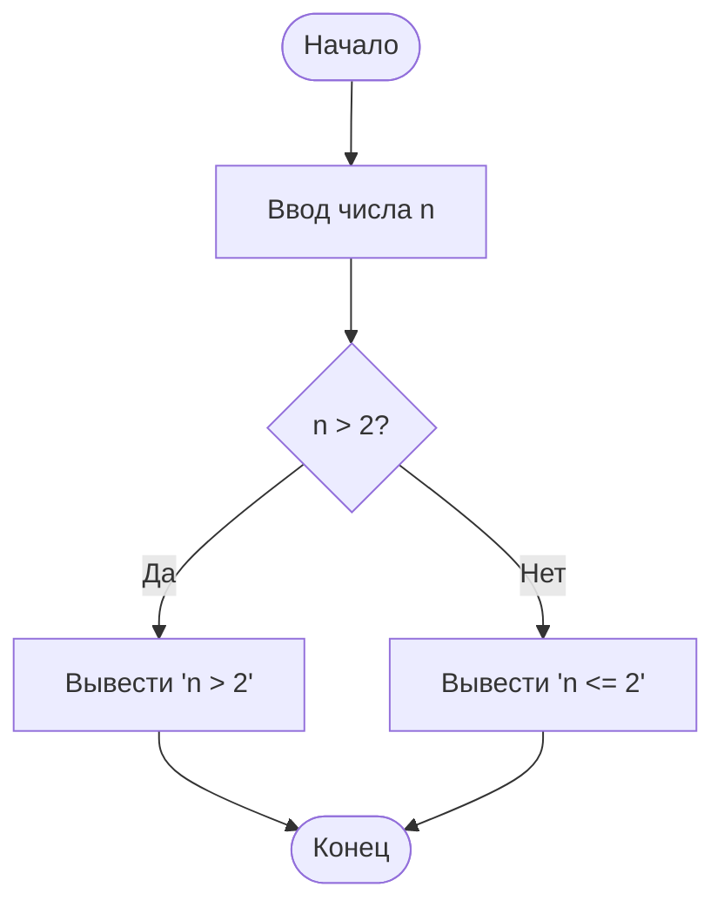

Министерство науки и высшего образования Российской Федерации 
ФГБОУ ВО 
Уфимский университет науки и технологий 
Кафедра АСУ

 
 
 

<strong>ОТЧЕТ</strong> 
по лабораторной работе № 3 
по дисциплине «Основы современных цифровых технологий и искусственного интеллекта» 
на тему: «Диаграмма как код»

 
 
 
 
 

Выполнил: студент гр. ИВТ-ИСУ-103Б Каримова М.Ф. 
Проверил: профессор каф. АСУ Арьков В.Ю.

 
 
 
 
 

Уфа 2025

## 1.   Алгоритм
Определение алгоритма (согласно Википедии):
Алгори́тм — конечная совокупность точно заданных правил решения некоторого класса задач или набор инструкций, описывающих порядок действий исполнителя для решения определённой задачи.

Происхождение слова:
Слово «алгоритм» происходит от латинизированного имени аль-Хорезми — выдающегося персидского математика Мухаммада ибн Мусы аль-Хорезми (IX век). В своих трудах он систематически описал методы решения линейных и квадратных уравнений, а также арифметические действия. Его имя в латинских переводах звучало как Algoritmi, и со временем термин стал обозначать любую последовательность действий для решения задачи.

## 2. Блок-схема или схема алгоритма
Согласно статье «Блок-схема» в Википедии, блок-схема — это графическое представление алгоритма с использованием стандартных геометрических фигур (блоков) и стрелок, показывающих порядок выполнения.

### Основные элементы блок-схем

#### Действие

#### Данные (ввод-вывод)

#### Предопределённый процесс (функция)

#### Вопрос (условие или решение)

#### Ограничитель

#### Цикл

#### Соединитель

#### Комментарий

#### Параллельные действия

## Задание
**Выясните с помощью любого интеллектуального помощника, когда «блок-схемы алгоритмов» стали называть «схемы алгоритмов» и почему.** Ответ с помощью интеллектуального помощника (YandexGPT):
Термин «блок-схема» (англ. block diagram) исторически использовался для описания графического представления алгоритмов с помощью блоков. Однако со временем, особенно с развитием стандартов (таких как ГОСТ 19.701-90 в России и ISO 5807 на международном уровне), более корректным и универсальным стало название «схема алгоритма» (англ. algorithm flowchart).
Причины перехода:

**Уточнение терминологии:** Слово «блок-схема» иногда ассоциировалось с другими типами диаграмм (например, структурными схемами систем), что вызывало путаницу.

**Стандартизация:** В профессиональной и учебной литературе, особенно в рамках инженерной и программистской культуры, утвердился более точный термин — «схема алгоритма».

**Уход от избыточности:** Слово «блок» уже подразумевается в схеме, поэтому его часто опускают для краткости.

## Задание
Найдите в интернете отечественный стандарт
по рисованию схемы алгоритма. Номер и название стандарта
можно найти в конце статьи про блок-схему из предыдущего задания. Просмотрите текст стандарта и обратите внимание на примеры оформления схем в конце текста.

Нас интересует
**ГОСТ 19.701-90 (ЕСКД)**

**Официальное название:** Схемы алгоритмов, программ, данных и систем. Условные обозначения и правила выполнения.

**Основная суть:**
Стандарт устанавливает правила оформления и условные графические обозначения для создания схем алгоритмов и программ (блок-схем) в документации на вычислительную технику и программное обеспечение.

**Ключевые моменты:**

1.  Определяет набор стандартных фигур (блоков) для отображения различных элементов алгоритма:
    *   **Процесс** (прямоугольник) — выполнение операции или группы операций.
    *   **Решение** (ромб) — точка ветвления алгоритма.
    *   **Модификация** (шестиугольник) — начало цикла.
    *   **Предопределенный процесс** (прямоугольник с двойными вертикалями) — вызов подпрограммы или стандартного модуля.
    *   **Данные (ввод-вывод)** (параллелограмм) — операция ввода или вывода информации.
    *   **Терминатор** (скругленный прямоугольник) — начало или конец алгоритма.
    *   **Соединитель** (круг) и **Линия** — для связи блоков и указания потока выполнения.

2.  Описывает, как правильно располагать блоки, соединять их линиями потока, нумеровать и подписывать. Устанавливает требования к оформлению документа.

3.  Стандарт предназначен для разработчиков, программистов и технических писателей при создании документации в соответствии с Единой системой программной документации (ЕСПД).

Ответ сформулирован с помощью YandexGPT:

1. Что такое Workflow Diagram?
**Workflow Diagram** (диаграмма рабочего процесса) — это графическое представление последовательности шагов, действий или задач, которые выполняются для достижения определённой цели в рамках бизнес-процесса или рабочего потока. Он показывает:
    *   Кто выполняет задачу (роли, отделы, системы),
    *   Что делается на каждом этапе,
    *   Как передаются данные или материалы,
    *   Где происходят задержки или ветвления.

**Примеры использования:**
    *   Описание процесса согласования документов,
    *   Схема обработки заказа в интернет-магазине,
    *   Процесс разработки ПО (например, по методологии Agile).

2. Что такое Flowchart?
**Flowchart** (схема алгоритма) — это более общий тип диаграммы, который показывает последовательность шагов для решения задачи или выполнения алгоритма. Она использует стандартные блоки (прямоугольники, ромбы, овалы) и стрелки для обозначения потока управления.
Примеры использования:
    *   Алгоритм сортировки чисел,
    *   Логика программы (условия, циклы),
    *   Технологический процесс в производстве.

3. Связь между Workflow Diagram и Flowchart
Workflow Diagram — это частный случай Flowchart, специализированный для описания бизнес-процессов и рабочих потоков.

Проще говоря:
    *   Каждый Workflow Diagram — это Flowchart, но не каждый Flowchart — это Workflow Diagram.
    *   Если в Flowchart добавить роли (кто выполняет), сроки и документы — получится Workflow Diagram.

**Итог:**
Workflow Diagram и Flowchart тесно связаны: первый является специализированным подвидом второго, ориентированным на визуализацию бизнес-процессов с учётом участников, ролей и документооборота. Оба инструмента используют единую графическую нотацию, но Workflow Diagram делает акцент на организационной стороне процессов.

## Задание
Выясните, что означает английское слово
Terminator (Терминатор), его происхождение, и какое отношение
всё это имеет к рисованию схемы алгоритма и к фильмам с участием Шварценеггера.

#### 1. Значение и происхождение слова

Слово «Terminator» происходит от латинского **«terminare»** — «ограничивать, завершать, положить предел». Английское слово **«terminate»** означает «прекращать, завершать».

В общем смысле «Terminator» — это тот, кто или то, что завершает, прекращает что-либо.

В схеме алгоритма «Терминатор» — это специальный символ (скругленный прямоугольник или овал), который обозначает начало или конец алгоритма, а также точку входа/выхода в подпрограмму.

#### 2. Отношение к фильмам с Шварценеггером

*   Робота из фильма «Терминатор» назвали так именно потому, что его главная и единственная миссия — завершить («terminate») жизнь Сары Коннор. Он не ведёт переговоров, не отступает — его функция — полное и окончательное прекращение её существования. Он — воплощение понятия «завершитель».
*   Он без эмоций, как строгий символ в схеме: получил цель (начало алгоритма) -> выполняет процесс (поиск и устранение) -> достигает цели (конец алгоритма). Его логика проста, как блок-схема.

## Задание
Сохраните вашу диаграмму во всех четырёх форматах. Ознакомьтесь с содержимым файлов. Изучите, как эти
файлы отображаются на экране при просмотре. Проверьте, как
меняется качество изображения при увеличении.

* .svg - отображается через браузер как XML-графика, без потерь качества при увеличении - линии остаются чёткими
* .html - отображается в браузере как веб-страница, при увеличении отображается отлично - полная интерактивность и масштабирование
* .png - пикселизация при >100% масштаба
* .drawio - отображается только в самом draw.io - содержит всю структуру

## 4.MERMAID
Новый, модный, популярный подход к рисованию схем называется Diagram as Code — «Диаграмма как код».Это рисование с помощью текста, текстового описания.Один из примеров бесплатных, популярных онлайн сервисов для создания диаграмм такого рода — это Mermaid. 

## Задание
Сохраните свою диаграмму в разных форматах
и изучите качество изображения.
* .svg - преимущества: абсолютная маштабируемость, небольшой вес файла, редактируемость и стилизация, интеграция в веб; недостатки: поддерживают не все системы
* .png - преимущества: универсальная совместимость, простая вставка; недостатки: пикселизация при увеличении, больший размер файла, не редактируется

## Задание
Скопируйте схему в буфер и вставьте её в текстовый редактор типа Word и в графический редактор типа Paint.
Сделайте вывод о том, в каком формате наше изображение копируется в буфер.

Так как вставилось не как редактируемая векторная графика - png.

Для Paint вставляется в формате png.

Cсылки, чтобы поделиться схемой онлайн:
* https://mermaid.ink/img/pako:eNo9kE1KxEAQha8SauVAJiTp_PZC0HHrBZxk0Ux3fiBJD20Hf4aAK72D4MIbZGFAEOcMlRvZE9Fa1fuo9wreAXaSC6BQNPJuVzGlrayzzFycbfENx_kFR_zCY76y1utz63KL7zjNTzjhB37iN475wjfm-hWPBkzzc74CG0pVc6Ba9cKGVqiWnSQcTuEZ6Eq0IgNqVi4K1jc6g6wbjG3Puhsp2z-nkn1ZAS1Yc2tUv-dMi6ualYq1_1SJjgu1kX2ngZLIX0KAHuDeSI84PnGTNPW9mJAwITY8APViJ_KDNEr92AvDOHCDwYbH5a_rJHFog-C1lur6t5ulouEH_WdqFQ?type=png
* https://mermaid.ink/svg/pako:eNo9kE1KxEAQha8SauVAJiTp_PZC0HHrBZxk0Ux3fiBJD20Hf4aAK72D4MIbZGFAEOcMlRvZE9Fa1fuo9wreAXaSC6BQNPJuVzGlrayzzFycbfENx_kFR_zCY76y1utz63KL7zjNTzjhB37iN475wjfm-hWPBkzzc74CG0pVc6Ba9cKGVqiWnSQcTuEZ6Eq0IgNqVi4K1jc6g6wbjG3Puhsp2z-nkn1ZAS1Yc2tUv-dMi6ualYq1_1SJjgu1kX2ngZLIX0KAHuDeSI84PnGTNPW9mJAwITY8APViJ_KDNEr92AvDOHCDwYbH5a_rJHFog-C1lur6t5ulouEH_WdqFQ

## Задание
Скопируйте диаграмму в буфер обмена в формате
Markdown и вставьте её в текстовую ячейку Google Colab. Затем
запустите текстовую ячейку на выполнение и перейдите
по ссылке, щёлкнув мышкой по диаграмме. Откроется страница
редактирования. Внесите небольшое изменение в диаграмму.
Скопируйте ссылку на код Markdown и вставьте его в эту же текстовую ячейку. Обратите внимание на изменение текстовой
строки

## 5. MERMAID + GITHUB
## Задание
Создайте в своём репозитории на GitHub новый файл с расширением MD и вставьте в него свою схему. Убедитесь, что схема отображается корректно. Скопируйте свою схему
в буфер обмена и вставьте её в текстовый и графический редактор. Сделайте вывод о том, в каком формате копируется изображение

## Задание 
Постройте более сложную схему алгоритма, в которой будут условный переход и вывод на печать. Вставьте схему в свою страничку на github.

## 6. MERMAID + COLAB

## Задание 
 Ознакомьтесь со следующими инструментами
и технологиями. Можете использовать Википедию и интеллектуальный чат-бот либо просто поиск в интернет.
base64, IPython, Jupyter Notebook, Pyplot, Matplotlib, UTF-8,
URL, ASCII, параметры и аргументы функции, string, multiline
string.

Ниже краткие объяснения по каждому термину и как они связаны между собой в программировании и работе с данными.

## Кодировки и текст

- **ASCII** — ранний стандарт кодировки, использующий 7 бит на символ и поддерживающий базовый латинский алфавит, цифры и некоторые знаки; всего 128 символов.
- **UTF‑8** — современная кодировка Unicode с переменной длиной от 1 до 4 байт на символ, полностью совместима с ASCII для первых 128 кодов и поддерживающая символы большинства языков мира.
- **string (строка)** — последовательность символов; в Python строка хранит текст в Unicode, обычно в UTF‑8 при записи в файлы и пересылке по сети.[2]
- **multiline string (многострочная строка)** — строковый литерал, который может содержать перевод строки и оформляется специальным синтаксисом (например, в Python тройные кавычки), что удобно для хранения длинных текстов и форматированных сообщений.

## Передача и представление данных

- **URL (Uniform Resource Locator)** — текстовая строка, описывающая расположение ресурса в сети (схема, домен, путь, параметры запроса); в ней запрещённые символы кодируются в виде процентов и байтов, как правило, в UTF‑8.
- **Base64** — схема кодирования «бинарное‑в‑текст»: переводит произвольные байты (файлы, бинарные протоколы) в строку из 64 печатных символов (A–Z, a–z, 0–9, «+», «/» и «=» для выравнивания), чтобы безопасно передавать их в текстовых форматах (JSON, e‑mail, URL‑совместимые варианты).

## Параметры и аргументы функций

- **Параметры функции** — имена внутри объявления функции, которые описывают, какие значения она ожидает (формальные параметры).
- **Аргументы функции** — реальные значения, которые передаются функции при вызове и подставляются на место параметров (позиционные, именованные, по умолчанию и др.).

## IPython и Jupyter Notebook

- **IPython** — интерактивная оболочка для Python, расширяющая стандартный REPL поддержкой удобных команд, истории, авто‑дополнения и «магических» команд для работы с файловой системой, профилирования кода и интеграции с выводом графиков.
- **Jupyter Notebook** — среда, в которой код (часто на Python), текстовые пояснения и результаты (включая графики и таблицы) объединяются в «ноутбук» из ячеек, удобный для обучения, исследований и анализа данных.

## Matplotlib и Pyplot

- **Matplotlib** — популярная библиотека визуализации данных на Python, позволяющая строить линейные, столбчатые, точечные графики и многое другое; широко используется в научных вычислениях и аналитике.
- **Pyplot (модуль matplotlib.pyplot)** — подмодуль Matplotlib с процедурным интерфейсом «как в MATLAB», в котором графики создаются последовательными вызовами `plt.plot`, `plt.xlabel`, `plt.show` и т.п.; особенно удобен в Jupyter Notebook.

## Задание
Перейдите на сайт https://mermaid.ink/ и изучите Getting Started. Проверьте, как поведёт себя на вашем компьютере приведённый в статье пример.

## Задание
Сформируйте ссылку для вывода вашей диаграммы и скопируйте её в буфер. Используя эту ссылку, напишите код для текстовой ячейки. Убедитесь, что диаграмма корректно отображается на экране.

https://mermaid.ink/img/ICAgZmxvd2NoYXJ0CiAgICBBKFvQndCw0YfQsNC70L5dKSAtLT4gQlvQktCy0L7QtCDRh9C40YHQu9CwIG5dCiAgICBCIC0tPiBDe24gPiAyP30KICAgIEMgLS0g0JTQsCAtLT4gRFvQktGL0LLQtdGB0YLQuCAnbiA+IDInXQogICAgQyAtLSDQndC10YIgLS0+IEVb0JLRi9Cy0LXRgdGC0LggJ24gPD0gMiddCiAgICBEIC0tPiBGKFvQmtC+0L3QtdGGXSkKICAgIEUgLS0+IEYoW9Ca0L7QvdC10YZdKQ==

## 7. BASE64 + API

## Задание
Просмотрите статью [Wiki: Base64] на Википедии.
Выясните, в чём заключается основная идея такого кодирования и что означает число 64 в этом обозначении. Обратите внимание на то, какие символы входят в «алфавит» этой кодировки —base64 alphabet. Это поможет понять, почему их набралось
именно 64 штуки. Конечно, это еще и степень двойки — для удобства передачи байтами.

Base64 — стандарт кодирования двоичных данных при помощи только 64 символов ASCII. Алфавит кодирования содержит латинские символы A-Z, a-z, цифры 0-9 (всего 62 знака) и 2 дополнительных символа, зависящих от системы реализации. Каждые 3 исходных байта кодируются четырьмя символами (увеличение на ¹⁄₃).

### Основная идея Base64

Base64 — это метод кодирования двоичных данных в текстовый формат, использующий только печатные символы ASCII для безопасной передачи по каналам, не предназначенным для бинарных потоков (например, email, JSON, HTML).
Алгоритм группирует входные данные по 3 байта (24 бита), разбивает их на 4 группы по 6 бит и заменяет каждую на символ из специального алфавита; при некратности добавляются padding-символы «=».

Число 64 отражает размер алфавита и соответствует \(2^6 = 64\) возможным комбинациям в 6-битной группе, что позволяет эффективно кодировать 6 бит в один символ (примерно 75% эффективности).
Это степень двойки обеспечивает удобство работы с байтами, минимизируя потери при преобразованиях.

## 8. MERMAID + VSCODE

## 9. MERMAID + DOCKER

## Задание
 Выполните описанные выше действия. Запустите
контейнер с онлайн редактором. Вставьте свой код и сгенерируйте диаграмму. Вставьте копии экрана в отчёт.

## 10. Почему русалочка?

## Задание
 Используйте интеллектуальных помощников и выясните значение названия и возможный смысл Mermaid, который вложили в это название авторы продукта.

### Название Mermaid

Название "Mermaid" (рус. «Русалка») происходит от мифического морского существа, известного грациозностью и плавностью линий, что символизирует простоту и элегантность генерации диаграмм из текста.

Авторы, возможно, выбрали это название, чтобы подчеркнуть идею "Diagram as Code" — преобразование простого текста в красивые, текучие визуализации, подобно тому, как русалка создаёт волны из движений.
Mermaid позиционируется как инструмент для разработчиков, где код генерирует диаграммы без графических редакторов, подчёркивая лёгкость и интуитивность.

## 11. MIND MAP

## Задание
Просмотрите статью Mind map на Википедии и обратите внимание на примеры таких диаграмм

Диагра́мма свя́зей, известная также как интелле́кт-ка́рта, ассоциати́вная ка́рта, мента́льная ка́рта или ка́рта мыслей (англ. Mind map) — метод структуризации и визуализации концепций с использованием графической записи в виде диаграммы.

Диаграмма связей реализуется в виде древовидной схемы, на которой изображены слова, идеи, задачи или другие понятия, связанные ветвями, отходящими от центрального понятия или идеи. Обычно создается вокруг одной концепции, нарисованной в виде изображения в центре пустой страницы, к которому добавляются связанные представления идей, такие как изображения, слова и части слов. Основные идеи напрямую связаны с центральной концепцией, а другие идеи являются ответвлениями от этих основных идей.

## 12. PLANTUML

## Задание
 Просмотрите статью PlantUML на Википедии. Обратите внимание на программы, которые поддерживают эту технологию

PlantUML — это инструмент с открытым исходным кодом, который позволяет пользователям создавать диаграммы на основе обычного текстового языка. Помимо различных UML-диаграмм, PlantUML поддерживает множество других форматов, связанных с разработкой программного обеспечения (таких как Archimate, блок-схема, BPMN, C4, схема компьютерной сети, ERD, диаграмма Ганта, интеллект-карта и WBD), а также визуализацию файлов JSON и YAML.

Существуют различные расширения или дополнения, включающие в себя PlantUML: Google Docs, LibreOffice, Microsoft Word может использовать диаграммы PlantUML с помощью надстройки Word Template, Notepad++, Visual Studio Code и т.д.

## Задание
 Откройте страницу проекта PlantUML на GitHub.
Обратите внимание на изображение зеленого листочка рядом
с названием

## Задание
 Просмотрите начало описания Mind map и обрати
те внимание на области применения данного инструмента.

Области применения Mind Map: обучение,
конспектирование лекций,
конспектирование книг,
подготовка материала по определенной теме,
решение творческих задач,
мозговой штурм,
презентации,
планирование и разработка проектов разной сложности,
составление списков дел,
развитие интеллектуальных способностей,
обобщение и структуризация знания,
составление органограмм.

## 12. Карта Профессии

## Задание
Выберите какую-нибудь компьютерную специальность, которая лично вам кажется интересной, привлекательный
и многообещающей. Если у вас появляются затруднения с выбором специальности, возьмите любую, первую попавшуюся. Это
упражнение, которое вас ни к чему не обязывает.

Мой выбор: Гейм-дизайнер (Game Designer)

Cпециалист, который придумывает и разрабатывает видеоигры. Его задача — создать увлекательный и сбалансированный игровой процесс, учитывая предпочтения игроков и взаимодействие с игровым миром. 

## Задание
Сформулируйте подробный промпт для карьерной
консультации. Назначьте чат-боту роль карьерного консультанта и дайте ему детальное описание задачи. Если появились какие
то сложности, попросите самого чат-бота сформулировать этот
самый промпт и посмотрите, как он на него же и отреагирует —
в рамках новой беседы. Пройдите эту «карьерную консультацию». В отчёте приведите только свой промпт и название профессии, которую вам порекомендовал чат-бот. Все подробности
и ваше общение с этим консультантом оставим за кадром. Это ваше личное дело. Нас будет интересовать только название профессии, которую мы далее будем рассматривать и моделировать

Промт:

Ты — экспертный карьерный консультант, специализирующийся на IT- и digital-сферах, задача которого провести глубокий и всесторонний анализ моих навыков, опыта, интересов и целей. Помоги мне определить профессию, которая максимально соответствует моим возможностям и имеет хорошие перспективы на рынке труда. Задавай вопросы, чтобы понять мои сильные и слабые стороны, опыт работы, образование, увлечения и цели. Учитывай текущие тенденции рынка труда и будущие перспективы развития профессий. По итогам консультации предложи конкретную профессию и опиши, почему она подходит. Также дай рекомендации по первым шагам для вхождения в неё.

### Версия схемы 01

### Версия схемы 02

### Сгенирированная чат-ботом схема 03

### Версия схемы 04

### Версия схемы 05

### Версия схемы расширенная 06

### Версия схемы 07

### Версия схемы 08

## 13. ОБОБЩЕНИЕ ИНФОРМАЦИИ ИЗ ФАЙЛОВ

## Задание

Используйте большие документы, имеющие отношение к выбранной вами специальности (профстандарты, программы курсов, описания вакансий и т.п.). Прикрепите их
к своим запросам — по отдельности и вместе. Опишите в отчёте полученные результаты. Используйте эти результаты при
уточнении своих диаграмм.

| Трудовая функция                     | Дисциплины                                                                                                 |
| ------------------------------------ | ---------------------------------------------------------------------------------------------------------- |
| Разработка интерфейсов (A01)         | HTML/CSS, JavaScript basics Profstandart_882-Razrabotchik-Web-i-multimedijnyh-prilozhenij.pdf​             |
| Адаптивный дизайн (A02)              | Responsive Web Design, CSS Frameworks Profstandart_882-Razrabotchik-Web-i-multimedijnyh-prilozhenij.pdf​   |
| Веб-анимация (A03)                   | CSS Animations, JavaScript Effects Profstandart_882-Razrabotchik-Web-i-multimedijnyh-prilozhenij.pdf​      |
| Frontend-верстка (A04)               | Advanced HTML/CSS, Preprocessors (SASS) Profstandart_882-Razrabotchik-Web-i-multimedijnyh-prilozhenij.pdf​ |
| Интерактивные элементы (A05)         | JavaScript DOM, Event Handling Profstandart_882-Razrabotchik-Web-i-multimedijnyh-prilozhenij.pdf​          |
| Клиентские приложения (A06)          | Frontend Frameworks (React/Vue) Profstandart_882-Razrabotchik-Web-i-multimedijnyh-prilozhenij.pdf​         |
| Web-компоненты (A07)                 | Web Components, Custom Elements Profstandart_882-Razrabotchik-Web-i-multimedijnyh-prilozhenij.pdf​         |
| UI/UX дизайн (A08)                   | User Interface Design, Figma Profstandart_882-Razrabotchik-Web-i-multimedijnyh-prilozhenij.pdf​            |
| Прототипирование (A09)               | Prototyping Tools, Agile UI Profstandart_882-Razrabotchik-Web-i-multimedijnyh-prilozhenij.pdf​             |
| Программирование UI (B01)            | JavaScript ES6+, TypeScript Profstandart_882-Razrabotchik-Web-i-multimedijnyh-prilozhenij.pdf​             |
| Фреймворки frontend (B02)            | React/Angular/Vue.js Profstandart_882-Razrabotchik-Web-i-multimedijnyh-prilozhenij.pdf​                    |
| State Management (B03)               | Redux, Vuex, Context API Profstandart_882-Razrabotchik-Web-i-multimedijnyh-prilozhenij.pdf​                |
| API интеграция (B04)                 | REST/GraphQL, Fetch/Axios Profstandart_882-Razrabotchik-Web-i-multimedijnyh-prilozhenij.pdf​               |
| Тестирование UI (B05)                | Jest, React Testing Library Profstandart_882-Razrabotchik-Web-i-multimedijnyh-prilozhenij.pdf​             |
| Оптимизация производительности (B06) | Web Vitals, Bundle Optimization Profstandart_882-Razrabotchik-Web-i-multimedijnyh-prilozhenij.pdf​         |
| Build инструменты (B07)              | Webpack, Vite, NPM Profstandart_882-Razrabotchik-Web-i-multimedijnyh-prilozhenij.pdf​                      |
| Версионный контроль (B12)            | Git, GitHub workflows Profstandart_882-Razrabotchik-Web-i-multimedijnyh-prilozhenij.pdf​                   |

## Задание

 Используйте те же документы и тот же запрос при
обращении к ГигаЧату. Опишите результаты в отчёте. Дополните
и уточните свои диаграммы — при необходимости.

## Дисциплины для фронтенд-разработчика

Ниже представлена таблица, содержащая трудовые функции и рекомендуемые дисциплины для каждого направления:

| Трудовая Функция                  | Дисциплина                               |
|----------------------------------|-----------------------------------------|
| **A/01** Проверка и отладка      | - Методы отладки ПО                     |
|                                  | - Современные компиляторы               |
| **A/02** Система контроля версий | - Git                                    |
|                                  | - Version Control Systems                |
| **A/03** Верстка страниц         | - HTML/CSS                               |
|                                  | - Cross-browser compatibility            |
| **A/04** Кодирование              | - JavaScript                             |
|                                  | - TypeScript                             |
| **A/05** Логическое тестирование  | - Unit Testing                           |
|                                  | - End-to-end testing                      |
| **A/06** Интеграционное тестирование | - API Testing                          |
|                                  | - Integration testing methodologies       |
| **B/01** Предварительные данные  | - Requirements gathering                 |
|                                  | - Business analysis                      |
| **B/02** Первоначальные требования | - Stakeholder management                |
|                                  | - Project scoping                        |
| **B/03** Планирование коммуникаций | - Communication skills                   |
|                                  | - Negotiation techniques                 |
| **B/04** Проектирование разделов  | - UX design                              |
|                                  | - UI prototyping                         |
| **C/01** Анализ требований        | - Requirement engineering                |
|                                  | - Functional specification writing       |
| **C/02** Технические спецификации | - Technical documentation creation       |
|                                  | - Specification validation               |
| **C/03** Проектирование           | - Software architecture design           |
|                                  | - Database modeling                      |
| **C/04** Юзабили-тестирование    | - Usability testing                      |
|                                  | - User behavior analytics                 |
| **C/05** Безопасность             | - Cybersecurity principles               |
|                                  | - Secure coding practices                |
| **C/06** Интеграционное тестирование | - System integration testing            |
|                                  | - Interoperability standards             |
| **D/01** Процесс разработки       | - Agile methodology                      |
|                                  | - Waterfall model                        |
| **D/02** Руководство документацией | - Documentation management systems      |
|                                  | - Tech writing                           |
| **D/03** Руководство проектированием | - Architecture review                    |
|                                  | - Design patterns                       |
| **D/05** Проверка работоспособности | - Debugging techniques                   |
|                                  | - Performance optimization              |

Эти дисциплины охватывают ключевые компетенции, необходимые для успешной карьеры в качестве фронтенд-разработчика.

## 14. ЯНДЕКС ВИКИ

## Задание
Откройте главную страницу проекта https://wiki.
yandex.ru/ И знакомьтесь с основными возможностями этой
платформы. Выясните, какова стоимость этой услуги.

Яндекс Вики — часть экосистемы Яндекс 360 для бизнеса, сервис для создания внутренней базы знаний компании: страницы, разделы, инструкции, регламенты, описания проектов и т.п., над которыми сотрудники могут совместно работать в визуальном редакторе или с разметкой (Markdown/YFM).

Сама Яндекс Вики предоставляется как часть пакетов Яндекс 360 для бизнеса и позиционируется как бесплатный инструмент внутри подписки: дополнительных платежей именно за Вики не требуется, она включена в тарифы Яндекс 360 (стоимость зависит уже от выбранного тарифа и количества пользователей, а не от самой Вики).

## Задание

 Просмотрите статью под названием Вики на Вики
педии. Выясните происхождение этого странного названия. Это
поможет понять основную идею данного проекта.

Название «Википедия» составлено из двух слов: «wiki» и «encyclopedia».​

Слово wiki пришло в английский из гавайского языка и означает «быстрый», им раньше называли веб‑сайты, которые можно оперативно править прямо в браузере многим пользователям. Слово encyclopedia происходит от традиции обозначать «полный круг знаний» — универсальное собрание сведений по самым разным областям.​

«Wikipedia» буквально можно понимать как «быстрая энциклопедия» или «энциклопедия, которую можно быстро и совместно дополнять», что отражает основную идею проекта — свободное, оперативное редактирование и расширение базы знаний силами сообщества.​

## Задание
На первой странице своего проекта Яндекс Вики
вставьте свою диаграмму из предыдущего раздела. Для выбора
команды из меню можно использовать наклонную черту /.

## Задание
 Выясните, что такое WYSIWYG, как это сокращение
расшифровывается и что оно означает.

WYSIWYG — это тип визуального редактора, в котором содержимое во время редактирования отображается почти так же, как в готовом документе или на опубликованной веб‑странице.​

Сокращение WYSIWYG расшифровывается как What You See Is What You Get — «что видишь, то и получаешь». Это означает, что пользователь работает не с кодом или разметкой, а с наглядным представлением результата: меняет шрифты, цвета, размещение элементов и сразу видит их финальный вид, пока программа «за кадром» автоматически генерирует нужный код.

## Задание
Переключите режим редактирования на разметку
Markdown и ознакомьтесь с содержимым ячейки.

## Задание
Создайте новый заголовок. Вставьте последнюю
версию диаграммы PlantUML. Сохраните изменения ячейки. Со
храните изменения страницы (кнопка справа вверху).

## Задание

 Создайте новую ячейку в Яндекс Вики и выберите
тип содержимого как диаграмму Draw.io. Нарисуйте несложный
алгоритм и сохраните результаты. Ознакомьтесь в режиме про
смотра с представлением диаграммы на экране.

## Задание
Просмотрите историю изменений своей страницы.

## 15. PLANTUML + DOCKER

## Задание
Попросите интеллектуального чат-бота объяснить
каждый параметр обеих команд. При необходимости задавайте
ему дополнительные вопросы. Это очень полезная функция современных чат-ботов. Мы можем вставить в запрос интересующую нас команду или даже целую программу. Затем мы просим его подробно объяснить каждый параметр и даже каждый символ. Раньше приходилось использовать поисковые системы
и искать ответы на форумах. Сейчас всё гораздо проще. Но,
к сожалению, к этим инструментам требуется добавить мотивацию и желание учиться. А этого чат-бот обеспечить пока не в состоянии.

### Общие параметры
`docker run -d -p 8080:8080 plantuml/plantuml-server:...`

### docker run

- `docker run` — команда «запусти новый контейнер».  
- Контейнер можно представить как отдельную мини‑программу в коробке: внутри есть своё приложение (здесь PlantUML‑сервер) и всё нужное для его работы.

### Параметр -d

- `-d` означает **запусти в фоне**.[1]
- Без `-d` вы бы видели в терминале логи сервера и не могли бы там ничего больше делать.  
- С `-d` контейнер тихо работает «за кулисами», а терминал сразу освобождается; при необходимости логи можно посмотреть отдельной командой.

### Параметр -p 8080:8080

- `-p` — это **проброс порта**, то есть соединение «снаружи → внутрь контейнера».[2][3]
- Запись `8080:8080` читается как «порт хоста : порт внутри контейнера».  
  - Первый `8080` — порт на вашем компьютере (хосте).  
  - Второй `8080` — порт внутри контейнера, где слушает сервер PlantUML.[2][1]
- В итоге, когда вы открываете в браузере `http://localhost:8080`, Docker перенаправляет запрос внутрь контейнера на его порт `8080`, и вы попадаете на работающий PlantUML‑сервер.

### Образы

1. `plantuml/plantuml-server:jetty` — официальный образ PlantUML‑сервера, где приложение развёрнуто на встроенном сервере **Jetty** (рекомендуемый вариант, современный стек Java).
2. `plantuml/plantuml-server:tomcat` — тот же PlantUML‑сервер, но упакованный как веб‑приложение, работающее на **Apache Tomcat** (полезно, если ближе Tomcat‑окружение или нужна совместимость с другими Tomcat‑решениями).

## Задание
 Запустите контейнер с сервером PlantUML. Вставь
те код своей диаграммы. ознакомьтесь с тем, как ваш локальный
сервер сгенерирует вашу схему. Внесите в схему небольшое изменение, например, измените цвет одного из блоков. Обратите
внимание на изменение диаграммы. Поэкспериментируйте с вариантами просмотра диаграммы View as и настройками сервера
Settings

Внесем небольшие изменения:

Посмотрим другие режимы отображения:

* png

* svg

* ascii

* pdf

Посмотрим другие настройки сервера:

## Вывод
В работе познакомилась с одной из довольно популярных в наши дни технологией - Diagram as code («диаграмма как код»). Можно сказать, что это одна из веток развития технологии облегчённой, упрощённой разметки текста Markdown, с которой мы познакомились в предыдущей лабораторной работе. Познакомилась с инструментами создания таких диаграмм - Mermaid и PlantUml, а также с инструментом "ручного" создания схем - Draw.io.

Оба инструмента для создания "кодовых" диаграмм  поддерживаются и интегрируются самыми разными платформами разработки и документирования, с которомы мы ознакомились в рамках данной лабораторной работы.
